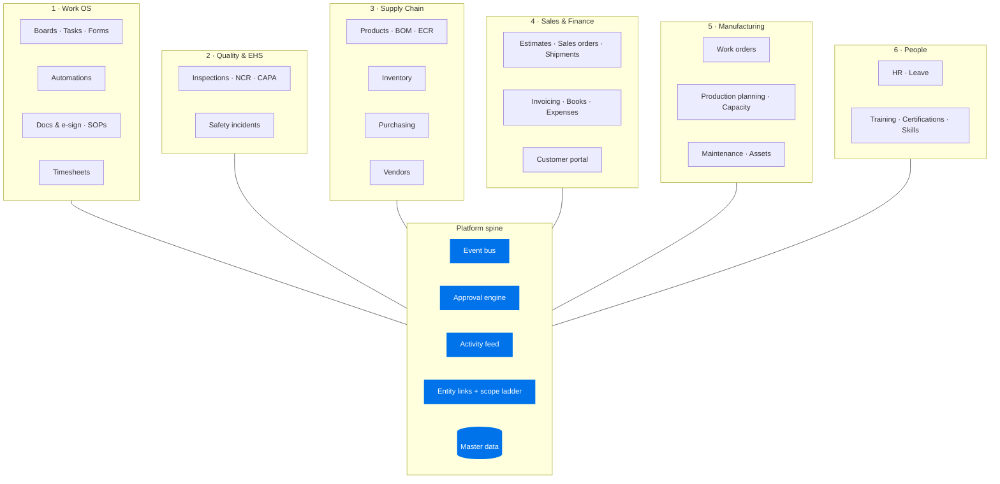

# 02 — Product Architecture

How the platform is organized as a product: suites, modules, feature hierarchy,
roles and permissions, and which department owns which workflow.

## 1. Suite map

Six suites over one spine. A suite is a navigation + permission + reporting
grouping; modules inside a suite share masters and workflows intensively, and
talk to other suites only through events and links.

## 2. Feature hierarchy (module → sub-module → capability)

Status: ✅ live · ⚠️ partial · 🔨 planned. (Code-verified; see
[01-current-state.md](01-current-state.md).)

### Suite 1 — Work OS (owns: everyone; admin: workspace admins)
- **Boards** ✅ — groups, items, custom columns (`cellValues`), saved permissions per board/column; views (table ✅, kanban/timeline 🔨 — see [07](07-ui-ux-design-system.md))
- **Forms intake** ✅ — public forms → board items (`form.submitted` loop)
- **Automations** ✅ board-scoped → 🔨 cross-module event recipes ([05 §4](05-workflow-architecture.md))
- **Docs & e-sign** ✅ — sign documents, recipients, fields, events; SOP library; PDF templates
- **Timesheets** ✅ — clock in/out at workspace/board/task scope; labor roll-up ⚠️
- **My Work inbox** 🔨 — cross-module: my approvals, my tasks, mentions, expiring items

### Suite 2 — Quality & EHS (owns: Quality dept)
- **Inspections** ✅ — versioned templates, snapshots, scoring, signatures, audit log, NCR numbering
- **CAPA / quality loop** ✅ — flagged inspection → corrective board task (`remediates` link)
- **Safety** ⚠️ — incidents, safety actions → 🔨 investigation loop, CAPA reuse, compliance register, cert-gated work ([04 §6](04-module-relationship-map.md))
- **Audits/compliance calendar** 🔨 — scheduled recurring inspections + findings register

### Suite 3 — Supply Chain (owns: Procurement + Stores)
- **Products** ✅ master, categories, units, specs, revisions; **BOM** ✅ tables / ⚠️ loops; **ECR** ⚠️ (tables live, propagation 🔨)
- **Inventory** ✅ — multi-warehouse, locations, lots/serials, immutable `stock_movements` ledger, valuation layers, cycle counts; reorder alert consumer 🔨
- **Purchasing** ✅ — requisitions ⚠️, POs + approvals, GRN, landed cost, returns; receiving-QC inspection hook ⚠️
- **Vendors** ✅ — contacts/addresses/banks/items; performance scoring 🔨; vendor portal (future)

### Suite 4 — Sales & Finance (owns: Sales + Finance depts)
- **Estimates** ✅ (versions, portal accept) → **Sales orders** ✅ (reserve stock) → **Shipments** ✅ (pick/pack/ship, single deduction) → **Invoices** ✅ (manual payments, recurring, dunning, credit notes)
- **Books** ⚠️ — ledger accounts, journals, trial balance; operational auto-posting 🔨 ([04 §7](04-module-relationship-map.md))
- **Expenses** ✅ — categories, advances, card transactions, approval, reimbursement
- **Customer portal** ✅ — estimates accept/reject, invoices, scoped docs
- **Price lists** ✅ tables / ⚠️ application logic

### Suite 5 — Manufacturing (owns: Production + Maintenance depts)
- **Work orders** ⚠️ — release ✅; material reservation 🔨, completion→stock 🔨
- **Production planning** ✅ — work centers, machines, shifts, skills matrix, process templates (stages, required skills, materials), capacity/material/manpower engine, conflicts, scenarios
- **Capacity planning** ✅ engine / 🔨 coupling to asset downtime + leave calendar
- **Maintenance** ⚠️ — assets, PM schedules, maintenance orders, parts; PM auto-generation 🔨, parts→stock 🔨, asset-status→capacity 🔨

### Suite 6 — People (owns: HR dept)
- **Employees** ✅ — master record, manager hierarchy, departments, shifts, skills
- **Leave** ✅ — types, balances, requests, approval, balance roll-up
- **Training** ✅ — courses, lessons, enrollments, auto-certification; expiry sweep ⚠️; cert-gating of assignments 🔨
- **Onboarding/offboarding flows** 🔨 — board-task checklists driven by HR events

## 3. Roles & permissions — evolution path

### Today (keep working)
- Global role on `users` (`admin/manager/user/worker`).
- Per-workspace `workspaceMembers.role` (owner/admin/member) + 7 boolean
  `canAccess*` module flags, enforced by `hasModuleAccess()`
  (`src/lib/services/access.ts`).
- Board/column-level grant tables for the Work OS.

### Step 1 — close the flag gaps (cheap, additive)
Add missing module flags for newer suites (production, maintenance, safety,
books) so every module is at least gateable. Keep `hasModuleAccess()` as the
single chokepoint.

### Step 2 — permission sets (RBAC v2, the enterprise model)
Table-driven, additive; `hasModuleAccess()` becomes a lookup into:

- `permission_sets` — workspace-scoped named bundles ("Finance Manager",
  "Stores Operator", "Quality Auditor"); seeded system sets per suite.
- `permission_set_entries` — `(setId, module, action)` where action ∈
  `view | create | edit | approve | admin`.
- `member_permission_sets` — member ↔ set (many-to-many).
- Back-compat shim: existing booleans map to generated sets during migration;
  flags become read-only derived values until UI cutover, then are dropped.

### Step 3 — data scoping (after RBAC v2)
- Department-scoped visibility (e.g. expenses/HR records visible to own
  department + finance), driven by `employees.departmentId`.
- Field-level redaction on sensitive columns (salary, bank accounts) by action
  level — enforced in the API serialization layer, not in the UI.

**Rule:** authorization decisions live in `src/lib/services/access.ts` only.
Routes never hand-roll role checks.

## 4. Workflow ownership matrix

Which department owns each document lifecycle, and who approves transitions.
This drives default `approval_policies` seeding ([05 §3](05-workflow-architecture.md)).

| Document | Owner (drafts/edits) | Approver(s) | Consumers of the outcome |
|---|---|---|---|
| Purchase requisition | Any member | Dept manager → Procurement | Procurement (converts to PO) |
| Purchase order | Procurement | Procurement manager; Finance above threshold | Vendor, Stores (GRN), Finance (bill) |
| Goods receipt / QC | Stores | Quality (if QC plan attached) | Inventory, vendor scoring |
| Estimate / quote | Sales | Sales manager above discount threshold | Customer (portal), Sales ops |
| Sales order | Sales | Ops (stock check) / auto | Stores (reserve/ship), Finance (invoice) |
| Invoice / credit note | Finance | Finance manager | Customer, Books |
| Expense | Employee | Manager → Finance above threshold | Finance (reimburse), project cost |
| Leave request | Employee | Manager (HR for long leave) | HR, time clock, production capacity |
| Work order | Production planner | Production manager | Stores (materials), shop floor, planning |
| Maintenance order | Maintenance | Maintenance lead | Production (capacity), Stores (parts) |
| ECR | Engineering | Engineering + Quality | Products/BOM revision, open POs/WOs review |
| Inspection / NCR | Quality | Quality manager sign-off | CAPA tasks, vendor scoring, compliance |
| Incident | Any employee (report) | Safety officer | Investigation task, CAPA, compliance register |
| Course assignment | HR / manager | — | Employee, certification, work gating |

Department = `departments` table; ownership is enforced as the default
`approval_policies` routing plus permission-set actions, not hard-coded.
