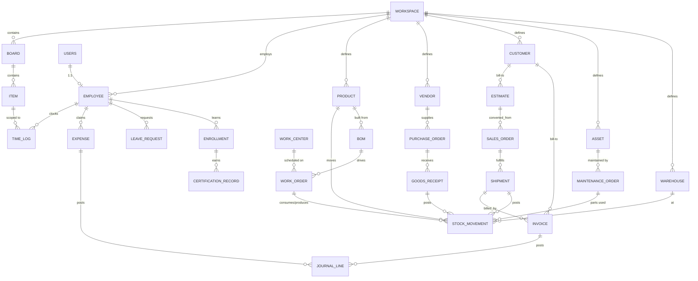

# 03 — Data Architecture

The entity model, the rules for how things relate, master-data strategy, and
data lifecycle/audit. The schema (`src/lib/db/schema.ts`, ~140 tables) already
follows most of this; this doc makes the rules explicit and binding.

## 1. Entity taxonomy — four kinds of data

Every table is exactly one of these kinds, and each kind has fixed rules:

| Kind | Examples | Rules |
|---|---|---|
| **Master data** (golden records) | `products`, `vendors`, `customers`, `employees`, `assets`, `warehouses`, `work_centers`, `ledgerAccounts`, `departments`, `taxRates`, `leaveTypes`, `courses` | One table per concept per workspace. Never duplicated, never hard-deleted (status/`archivedAt`). Documents point at them by FK. Changes emit `*.updated` events. |
| **Documents** (lifecycle objects) | `estimates`, `salesOrders`, `purchaseOrders`, `invoices`, `expenses`, `workOrders`, `maintenanceOrders`, `inspections`, `leaveRequests`, `shipments`, `goodsReceipts`, `incidents`, `engineeringChangeRequests` | Have `docNumber` (via `document_sequences`), a status machine ([05 §2](05-workflow-architecture.md)), scope-ladder columns, `createdBy`. Soft-delete only. Every transition emits an event. |
| **Ledgers** (append-only facts) | `stockMovements`, `valuationLayers`, `journalLines`, `timeLogs`, `activityFeed`, `signEvents`, `inspectionAuditLog`, `automationLogs` | Insert-only; corrections are reversing entries, never updates. Balances (`stockLevels`, `leaveBalances`) are derived projections of a ledger — never edited directly. |
| **Graph & platform** | `boards/groups/items/cellValues`, `entityLinks`, `linkPolicies`, `approvalRequests/Steps/Policies`, `eventOutbox`, `notifications`, `documentSequences` | Shared infrastructure; modules consume, never fork. |

## 2. Relationship rules — three mechanisms, used deliberately

The platform has exactly **three** ways to relate records. Choosing correctly is
the core data-architecture discipline:

1. **FK to master data** — a document names *what/who it is about*:
   `invoice.customerId`, `poLineItem.productId`, `maintenanceOrder.assetId`.
   Hard FK, validated at write time.
2. **Scope ladder** — a document names *which work it belongs to*:
   `boardId/groupId/itemId/linkLevel` columns (project → group → task), governed
   by `link_policies` per workspace × module (mode disabled/optional/required,
   depth bounds). This is how costs, docs, and activity roll up to projects.
   **To enforce in Phase 1** — today the columns exist but policies aren't
   checked on all creation paths.
3. **Typed `entity_links`** — a document relates to *another document*, loosely:
   polymorphic `(fromType, fromId, relation, toType, toId)`. Canonical relation
   vocabulary (extend this list, don't invent synonyms):

| Relation | Example pairs |
|---|---|
| `converted_from` | estimate→sales order, estimate→invoice, requisition→PO |
| `fulfills` | PO→requisition, shipment→sales order, WO→sales order |
| `remediates` | corrective task→inspection, CAPA task→incident |
| `evidence_for` | inspection→GRN (receiving QC), document→audit finding |
| `billed_by` | sales order/shipment/timeLog→invoice line |
| `consumes` / `produces` | work order→stock movement (materials / finished goods) |
| `caused_by` | maintenance order→incident, NCR→vendor |
| `certifies` | certification record→course, sign document→certification |

Anti-rule: **no new pairwise join tables** between documents. If two documents
need relating, it's an `entity_links` relation. (Existing direct FKs like
`salesOrders.estimateId` stay — they're the "primary" relation; `entity_links`
mirrors them for uniform graph queries.)

## 3. Core ER map (direction of dependency)

(Scope ladder, `entity_links`, approvals, and `activity_feed` attach to nearly
every box above and are omitted for readability.)

## 4. Master-data strategy

- **Golden record per workspace.** `products` is already referenced by 28
  tables across sales, purchasing, inventory, BOM, work orders, and maintenance
  parts — keep it that way. Same for `vendors`, `customers`, `employees`,
  `assets`, `warehouses`.
- **Master changes are events.** Phase 1 adds `product.created/updated`,
  `customer.created/updated`, `asset.status_changed`, etc., so downstream
  modules (open POs on a deactivated product, planning on a down asset) can
  react. Today masters are silent — gap G1.
- **Deactivation, not deletion.** Masters get `status`/`archivedAt`; archived
  masters stay referencable by historical documents but are excluded from
  pickers.
- **De-duplication at the edge.** CSV import (`data-io`) and creation APIs do
  workspace-scoped uniqueness checks (SKU, vendor code, customer email/tax id).
- **Org-level sharing (future, [06 §1](06-enterprise-readiness.md)):** when the
  `organizations` layer lands, masters gain optional org-scope so sister
  workspaces can share a catalogue without copying rows.

## 5. Data lifecycle & audit

- **Documents:** status machines with explicit terminal states
  (`closed/cancelled/void/rejected`); soft-delete via `archivedAt` or a `void`
  status. Hard `DELETE` is reserved for drafts that never left the author.
- **Ledgers:** append-only; corrections are reversing rows
  (`reservation_release`, credit notes, reversing journals). `stockLevels` and
  `leaveBalances` are projections — rebuildable from their ledgers.
- **Universal audit trail = events → `activity_feed`.** Because every state
  change emits an event (rule 2 in [README](README.md)) and `runActivityFeed`
  projects it, the feed *is* the audit log at item/board/workspace level.
  Specialized audit tables (`inspectionAuditLog`, `signEvents`) stay for
  regulated detail.
- **Row provenance convention:** all documents carry `createdBy` +
  `createdAt/updatedAt`; Phase 4 adds `updatedBy` to financial and HR tables
  plus an optimistic `version` column where concurrent edits matter (board
  items, planning schedules).
- **Snapshots for legal fidelity:** keep following the existing pattern —
  `inspections.templateSnapshot`, `estimate_versions` — wherever a document must
  be reproducible as-signed/as-sent (add: PO sent revision, invoice sent PDF).
- **Retention:** workspace-level export (CSV via data-io today, API later);
  deletes of a workspace are admin-only, two-step, and event-logged.

## 6. Conventions (already in code — binding for all new work)

| Concern | Convention | Where |
|---|---|---|
| Document numbering | `document_sequences` keyed `(workspaceId, docType)`, format strings (`INV-{YYYY}-{SEQ}`) allocated inside the producing transaction | `documentSequences` |
| Money | Integer minor units everywhere; helpers in `src/lib/money.ts`; no floats | all monetary columns |
| Tax | `taxRates` per workspace, referenced by line items | line-item tables |
| Localization | per-workspace locale/units config | `src/lib/localization.ts` |
| Validation | Zod schemas per module | `src/lib/validations/` |
| IDs | UUID/text PKs per existing tables; FKs always workspace-consistent (both rows same `workspaceId`) | schema |
| Tenant safety | every query filters `workspaceId`; cross-workspace joins are a bug by definition | all routes |

## 7. Schema direction (what changes, what doesn't)

**No restructuring of existing tables is needed.** The model is already
normalized around golden masters and ledgers. Planned additive changes only:

1. Missing module-access columns / permission-set tables ([02 §3](02-product-architecture.md)).
2. `organizations` (+ nullable `workspaces.organizationId`) ([06 §1](06-enterprise-readiness.md)).
3. `approval_steps.dueAt` + escalation fields ([05 §3](05-workflow-architecture.md)).
4. `webhook_subscriptions` + `api_keys` ([06 §4](06-enterprise-readiness.md)).
5. `updatedBy`/`version` columns on sensitive tables (Phase 4).
6. Posting-rule config for Books auto-posting ([04 §7](04-module-relationship-map.md)).

Everything else in Phases 1–2 is *wiring* (events, consumers, links), not schema.
